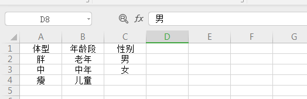

# 测试理论

## 边界值与等价类

通过等价类思想可以找到有效和无效的内容，在通过边界值思想把测试用例具体化；边界值是配合等价类思想使用的。

**边界值：** 比边界值大一点、和小一点的值都要测试到位。

.png)

## 判定表

    由因果图制作的表叫判定表。

### 判定表组成

- **条件桩：** `问题的所有条件`
- **动作桩：** `问题的所有输出`
- **条件项：** `针对条件桩的取值`
- **动作项** `各条件项的各种取值情况下的输出结果`

.jpg)

### 步骤
1. 找到所有的条件桩（输入条件）和动作桩（输出结果），把具体的条件项（所有输入的条件）和所有的输出条件（动作项）填写进去。
2. 得到初始表格后，根据实际需求进行简化。（合并中使用“-”代表无关条件，选什么都不影响结果）

## 场景法

    模拟用户操作软件时的流程，主要用于测试系统的业务流程。在冒烟测试时主要使用的就是场景法。

### 基本流

    按照正确的业务流程来实现一条操作流程（模拟正确的操作路径）

### 备选流

导致程序出现错误的操作流程（模拟错误的操作路径）

`用例场景是用来描述流经用例路径的过程，这个过程从开始到结束遍历用例中所有基本流和备选流。`

## 流程分析法

    测试用例必须包含所有分支条件，每一个分支条件就是一条测试用例。

- 流程分析法主要是针对测试场景类型属于流程测试场景的测试项下的测试子项进行设计，是从白盒测试设计方法中的路径覆盖分析法借鉴过来的一种方法。

    - 在白盒测试中，路径就是指函数代码的某个分支组合，路径覆盖法需要构造足够的用例覆盖函数的所有代码路径。

    - 在黑盒测试中，若将软件系统中某个流程看成路径的话，则可以针对该路径使用路径分析的方法设计测试用例。

## 错误推测法

  - 错误推测法是指利用直觉和经验猜测出出错的可能类型，有针对性列举出程序中所有可能的错误和容易发生错误的情况，他是测试经验丰富的测试人员喜欢使用的一种测试用例设计方法。

  - 基本思想：
  列举出可能犯的错误或错误容易发生的清单，然后根据清单编写测试用例；这种方法很大程度上是凭经验进行的，即凭人们对过去所测试结果的分析，对所揭示缺陷的规律性作直觉的推测来发现缺陷。

  ## 正交排列法

  - 正交排列法概述
    - 正交 排列法能够使用最小的测试过程集合获得最大的测试覆盖率。当可能的输入数据或者输入数据的组合数量很大时，由于不可能为每个输入组合都创建测试用例，可以采用这种方法。

 - 正交实验设计
    - 是研究多因素多水平的一种设计方法，它是根据正交性从全面实验中挑选出部分有代表性的点进行实验，这些有代表性的点具备了“**均匀分散，齐整可比**”的特点，正交实验设计是一种基于正交表的、高效率、快速、经济的实验设计方法。
### 标准正交表

 - 正交表：一种特制的表，一般的正交表记为：Ln(m^k)，该表为标准正交表。
    - n是表的行数，也就是需要测试组合的次数
    - k是表的列数，表示控件的个数（因素的个数，或因子个数）
    - m是每个控件包含的取值个数（各因素的水平数，即各因素的状态数）
    - 如：L9(3^4)
        - 有4个控件
        - 每个控件有3个取值
        - 9为需要测试的组合个数
        - 叫4因素3水平

- 查询正交表的步骤
    1. 先确定几因素，几水平
    2. 在“常用正交表”中找到合适的表格
    3. 复制找到的表格到我们自己的表格中
    4. 自己再写一个对照表（把所有的控件和对应的选项列出来）
    5. 把复制过来的表格和对照表实现映射关系，就可以得到最终的正交表（测试用例）

    **注意： 如果没有找到合适的正交表，要在表格中找到多一些的正交表选用即可，只需要把多余的内容删除。**
    
    正交表可使用正交设计助手工具生成正交表。

### 混合正交表

控件（选项）中可选值数量不同的正交表叫混合正交表。例如：3个控件，其中有两个控件有5个选项，一个有3个选项。

    该中情况可使用工具allpairs生成测试案例。

- 很多情况下无法找到合适的正交表，就要使用正交表生成工具
- 使用步骤：
    1. 制作对照表（只列出数据即可，不用编号）
    
    2. 复制取值表的数据，放到文本文档中保存（注意不要更改任何格式，例如文件叫Test2.txt）
    
    3. 把文本文档放在allpairs文件夹中
    4. win+r后输入cmd进入控制台
    5. 使用控制台代码进入allpairs文件夹（cd 目录名字）
    6. 在控制台输入allpairs.exe Test2.txt>chenggong.txt(chenggong是自己起的名字，用来存放生成的组合用例，可以生成，不必体检建好,该文件中存放的就是最终结果)
    
    7. 找到最终建好的chenggong.txt，打开后，复制第一大段内容到Excel表格中（如果遇到"-"或"~"则表示该项输入任何值都不影响）